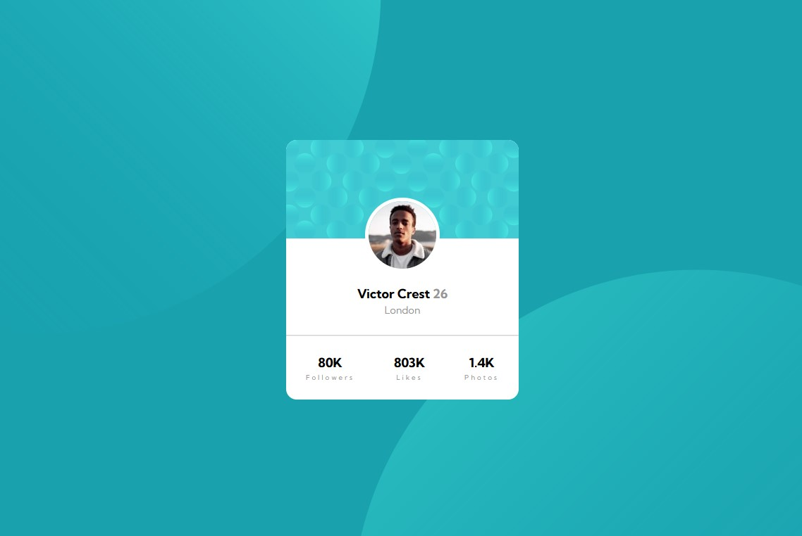

# Frontend Mentor - Profile card component solution

This is a solution to the [Profile card component challenge on Frontend Mentor](https://www.frontendmentor.io/challenges/profile-card-component-cfArpWshJ). Frontend Mentor challenges help you improve your coding skills by building realistic projects. 

## Overview
Social media profile card component with responsive background.

### Screenshot

### Links

- Solution URL: [Add solution URL here](https://github.com/palmettophoto/profile-card-component.git)
- Live Site URL: [Add live site URL here](https://palmettophoto.github.io/profile-card-component/)

### Built with

- Semantic HTML5 markup
- CSS custom properties
- Flexbox

### What I learned

Primarily the responsive background and positioning of layered images.

### Useful resources

mdn
w3schools

## Author

- Website - [Add your name here](https://rockhillvideomarketing.com)
- Frontend Mentor - [@Taddo](https://www.frontendmentor.io/profile/Taddo)

## Acknowledgments

Kevin Powell
